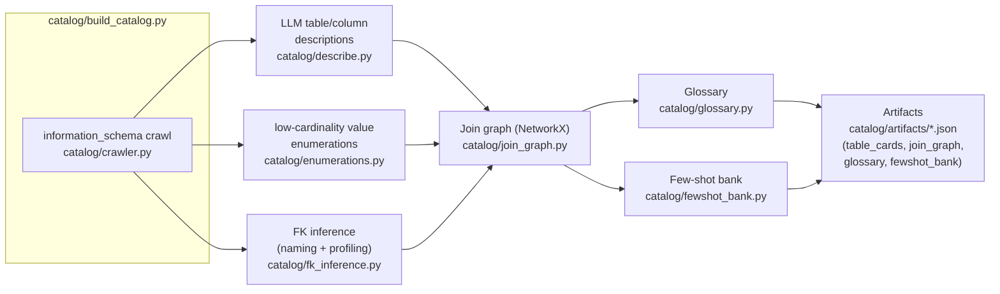
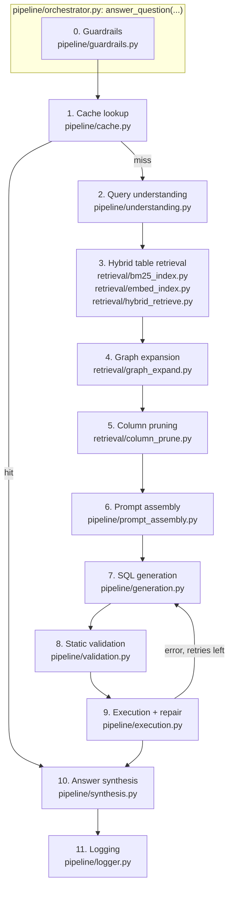

# Architecture

This implements the design in [`docs/original-design-doc.md`](docs/original-design-doc.md):
an offline plane that builds a schema catalog once (and on schema drift), and
an online plane that answers each question by retrieving a minimal schema
slice rather than stuffing the whole 74-table schema into every prompt.

## Offline plane: building the catalog

## Online plane: answering one question (12 stages)

## The seam between stages: `contracts/types.py`

Every stage reads from and writes to a single `PipelineContext`, so stages
can be built, tested, and swapped independently without touching each
other's code:

- `RetrievalResult` -- stage 3's output (candidate tables + scores)
- `GraphExpansionResult` -- stage 4's output (`all_tables`, bridge tables, join paths)
- `PrunedSchema` -- stage 5's output (kept columns + rendered schema text)
- `ValidationResult` -- stage 8's output (parse/lint/EXPLAIN outcome)
- `ExecutionResult` -- stage 9's output (rows, row count, truncated, error)
- `PipelineContext` itself -- threaded through every stage; carries the
  running `sql_candidate`, `answer`, `cache_hit`, `retries`, `tokens_used`,
  and `stage_timings_ms`

`TableCard`, `ColumnCard`, and `JoinEdge` are the offline plane's equivalent
seam: what the catalog produces and what retrieval/generation consume.

## Scaled down vs. the full production design

Mirrors doc sections 5 and 9 ("Answers to the Specific Production Questions",
"Trade-offs and Alternatives Considered"):

| Doc's production answer | What this repo does | What changes at real scale |
|---|---|---|
| Postgres/Oracle/MySQL legacy RDBMS, 100+ tables, real read replica | SQLite, 74 tables, single file, one read-only connection | Swap `contracts/db.py`'s connection helper for a pooled driver against the real dialect; sqlglot dialect pinning already anticipates this |
| Metadata vector index (hosted, e.g. pgvector/Pinecone) + NetworkX join graph | Local `sentence-transformers` embeddings + `rank_bm25`, in-memory NetworkX graph, JSON artifacts on disk | Swap the embedding index for a hosted vector DB only once catalog size or query volume outgrows a single process; doc explicitly says NetworkX is fine "up to a few thousand tables" |
| One frontier + one small model, cheap/strong routing (doc's cost lever) | Same routing, one provider (Anthropic: `claude-haiku-4-5` cheap / `claude-sonnet-5` strong) | Multi-provider routing/fallback is an operational nicety, not an architecture change -- `contracts/llm_client.py`'s `LLMClient` ABC is the seam to add a second provider |
| Dashboards (Grafana/Prometheus), alerting on error-rate/token-creep/cache-collapse | JSONL event log (`pipeline/logger.py`) + `eval/metrics.py` CLI summarizing cache hit rate, tokens/query, latency percentiles, error rate | Ship the same JSONL fields to a metrics backend; the log schema is already the contract, just change the sink |
| Docker/Kubernetes deployment, read replica pool, keep-warm connections | Single-process `uvicorn`/`streamlit`, no containerization | Containerize once there's more than one deployment target; nothing in the pipeline assumes in-process execution |
| Golden set: 200-500 pairs mined from real query logs + domain experts | ~56 hand-written pairs (no real query logs exist for a synthetic DB) | Mine `eval/golden_set.jsonl` growth from corrected production pairs once the online feedback loop (doc section 6) exists |
| Nightly catalog refresh + DDL-trigger invalidation | `scripts/build_all.py` run manually / on demand | Wire to a scheduler (cron, Airflow) once the schema is a moving target instead of a frozen seed |
